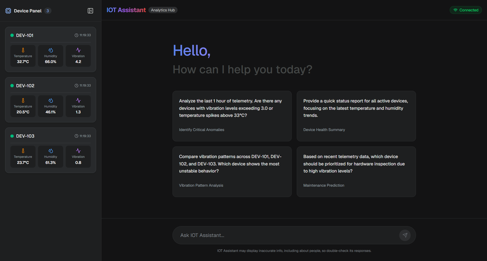
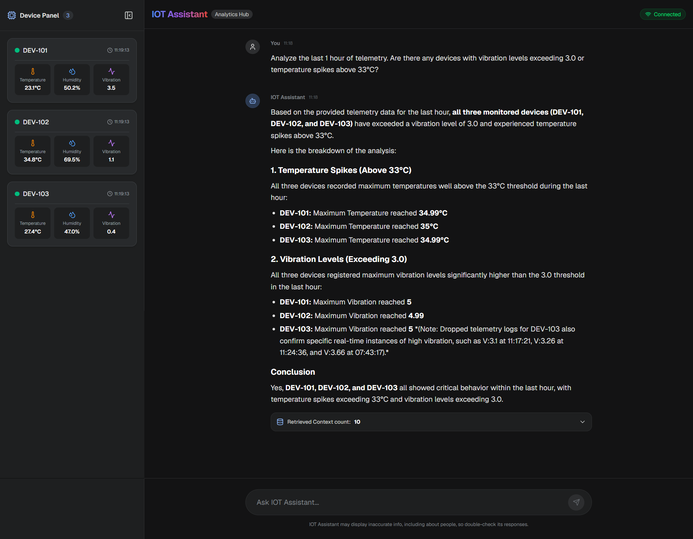
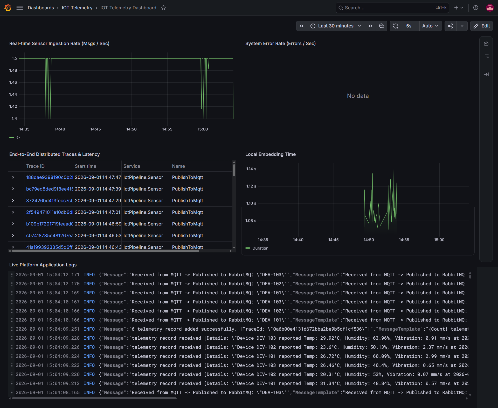
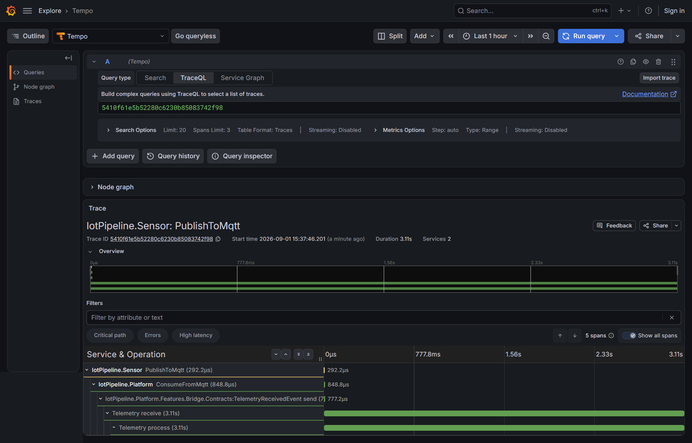

# Real-Time IoT Telemetry Stream & Generative AI (RAG) Platform




A production-minded, end-to-end telemetry monitoring and intelligent anomaly analysis demo platform. The system collects high-frequency virtual sensor data from virtual industrial IoT edge devices , processes it through asynchronous messaging pipelines, stores vector embeddings in **PostgreSQL (pgvector)**, and performs **Generative AI / RAG (Retrieval-Augmented Generation)** analysis for explainable real-time insights.

---

## 🏛️ Architectural Style & Design Principles

* **Event-Driven Architecture (EDA):** Ingestion, processing, and storage pipelines are completely decoupled using an asynchronous event-based backbone.
* **Vertical Slice Architecture:** Rather than traditional layered/monolithic architectures, the solution is structured around feature slices (`Bridge`, `Ingestion`, `Analytics`), ensuring high cohesion and low coupling.
* **CQRS Pattern:** Commands and Queries are cleanly separated via MassTransit Mediator.
* **Extensible & Pluggable AI and Embedding Services (SOLID):** 
  * The solution abstracts all artificial intelligence and vector generation operations behind dedicated interfaces (`IRagService` and `IEmbeddingService`).
  * Any alternative AI provider (e.g., OpenAI, Anthropic Claude, local Ollama/LlamaSharp) or embedding engine can be plugged in by implementing the respective interface without modifying existing business logic or API endpoints.
* **Hybrid Local/Cloud RAG Pipeline:** Embeddings are generated locally on the CPU, eliminating external embedding API costs and network dependencies, while LLM reasoning is handled dynamically with compact context formatting.

---

## 🛠️ Tech Stack & Key Components

### Backend & Infrastructure
* **.NET 10 (C#):** Core backend engine built with ASP.NET Core Minimal APIs for minimal overhead.
* **MQTT & MQTTnet:** Simulates field hardware and publishes telemetry payloads over lightweight protocols.
* **Eclipse Mosquitto:** Edge-level lightweight MQTT message broker.
* **RabbitMQ & MassTransit:** Enterprise message routing, prefetch control, Consumer batching, and Mediator dispatching.
* **PostgreSQL 16 & pgvector:** Unified relational and high-dimensional vector database supporting vector operations directly in SQL.
* **Entity Framework Core:** High-throughput data access and dimensioned vector mapping.
* **SignalR:** Server-to-Client streaming pushing live telemetry readings every 3 seconds to connected dashboards via WebSockets.
* **Local Embeddings (ONNX):** In-process 384-dimensional vector embedding engine running without external network dependencies.
* **Google Gemini 3.6 Flash:** Large Language Model utilized for semantic reasoning and context-grounded anomaly analysis.
* **Grafana LGTM Stack:** Unified observability platform combining logs, metrics, distributed traces, and dashboards through Loki, Prometheus, Tempo, and Grafana.
* **Docker & Docker Compose:** Containerized environment orchestrating Mosquitto, RabbitMQ, PostgreSQL and LGTM instances

### Frontend
* **Next.js (React) & TypeScript:** Modern, type-safe reactive dashboard.
* **Tailwind CSS:** Industrial dark-mode UI with low latency rendering.
* **@microsoft/signalr:** Handles bidirectional WebSocket connections, real-time telemetry stream subscriptions, and conversational AI interactions.

---

## 🔄 End-to-End Data Pipeline

```text
[IoT Device Simulators]
         │ (MQTT Protocol)
         ▼
  [Mosquitto Broker]
         │ (Background MQTT Listener)
         ▼
[IoT.Platform: Bridge Service]
         │ (Publish: TelemetryReceivedEvent)
         ▼
   [RabbitMQ Exchange]
         │ (Prefetch: 200, Batch Limit: 100 or 3s)
         ▼
[MassTransit Batch Consumer]
   ├── 1. Local Vectorization (IEmbeddingService - 384-dim)
   └── 2. Bulk Insert (EF Core AddRangeAsync)
         │
         ▼
[PostgreSQL + pgvector] ◄─── (HNSW Index / Cosine Distance)
         │
 ┌───────┴──────────────────────────────────────────┐
 │                                                  │
 │ (3s Streaming via SignalR)                       │ (Natural Language RAG Query)
 ▼                                                  ▼
[Device Telemetry Panel]                     [Ask AI Assistant Panel]
(Live Temp, Hum, Vib cards)                  ├── 1. Query Vectorization (IEmbeddingService)
                                             ├── 2. Top-10 Vector Similarity Retrieval
                                             ├── 3. Statistical Baseline Aggregation
                                             └── 4. LLM Reasoning (IRagService)
```

* **Edge Simulation:** Independent device workers (DEV-101, DEV-102, DEV-103) generate synthetic temperature, humidity, and vibration readings to MQTT topics.

* **Protocol Bridging:** A hosted background worker consumes MQTT packets, normalizes payloads, and publishes them as enterprise events (TelemetryReceivedEvent) to RabbitMQ.

* **High-Throughput Batch Ingestion:** MassTransit buffers messages in-memory (up to 100 items or 3-second windows). Vectors are generated locally via IEmbeddingService and written to PostgreSQL in single multi-row SQL insert operations.

* **Live Stream Subscription:** The SignalR Hub streams latest state snapshots per device to active clients every 3 seconds using composite indexes (DeviceId, Timestamp DESC).

* **RAG-Powered Anomaly Querying:** Natural language questions are converted into search vectors. Relevant contextual logs retrieved via HNSW Cosine Distance search are combined with statistical 1-hour baselines and passed to IRagService to generate grounded, explainable answers.

---

## 📊 Observability & Monitoring (Grafana LGTM)
The platform features an integrated Grafana LGTM Observability Stack designed to monitor system health, throughput, and distributed performance in real-time.



### What You Can Monitor via the Dashboard
* **Real-time Sensor Ingestion Rate (Throughput):** Track live incoming message rates per second across all platform services using Loki log queries.

* **System Error Rate:** Monitor critical errors or exceptions across microservices instantly.

* **End-to-End Distributed Traces & Latency:** Inspect execution spans (PublishToMqtt, ConsumeFromMqtt, GenerateEmbeddingsBatch, and SaveTelemetryBatchToDatabase) across both IotPipeline.Sensor and IotPipeline.Platform.

* **Local Embedding Time:** Evaluate the processing speed of the in-process 384-dimensional ONNX vectorization pipeline.

* **Live Application Logs:** Stream structured backend logs directly within the Grafana interface for rapid debugging.


---

## ⚡ Performance & Database Optimizations

* **HNSW Vector Indexing:** HNSW-based approximate nearest-neighbor search for efficient vector retrieval.
* **Composite B-Tree Indexes:** Defined on (DeviceId, Timestamp DESC) for efficient device-specific and time-series lookups.
* **Batch Ingestion:** Buffers telemetry messages into configurable batches, reducing database round-trips and improving ingestion efficiency.
* **Token-Optimized Context Formatting:** Telemetry contexts are arranged in short lines separated by delimiters.

---

## 🚀 Getting Started

### Prerequisites
* Docker & Docker Compose


### Set Environment Variables
Create a .env file using the .env.example file and prepare its contents.

### Start Containers

```bash
docker compose up -d
```

---

## Access Points
#### Web UI (Real-time Telemetry & AI Assistant)
Navigate to http://localhost:3000

#### Grafana Observability Dashboard
Navigate to http://localhost:3001 and import the dashboard (/grafana/dashboard/iot-dashboard.json) to inspect live metrics, traces, and application logs.